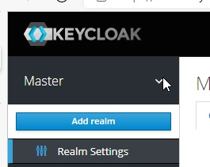
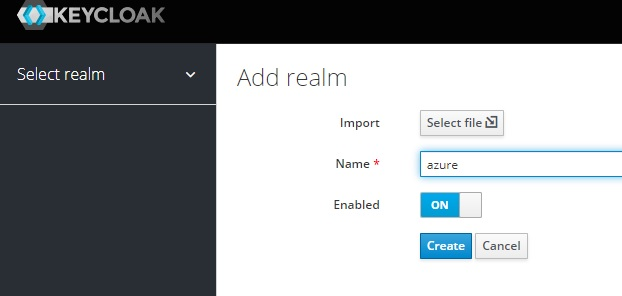
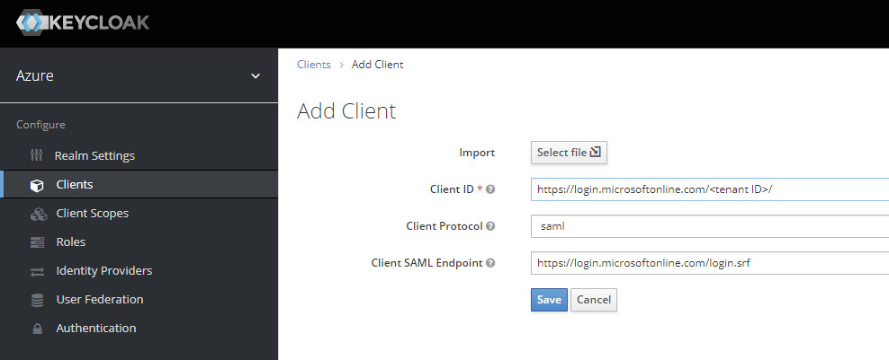
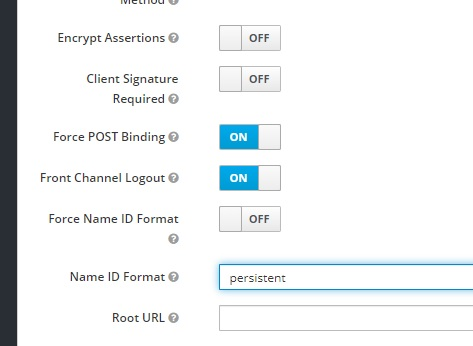
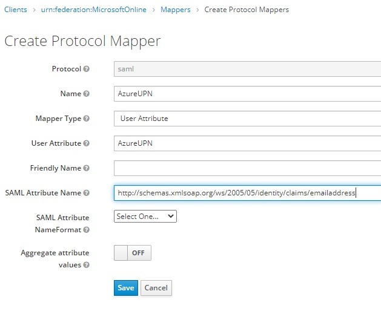
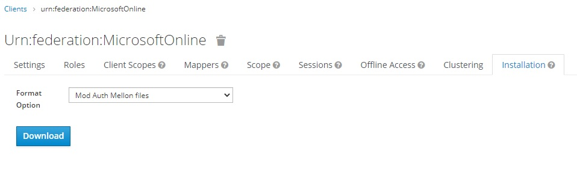
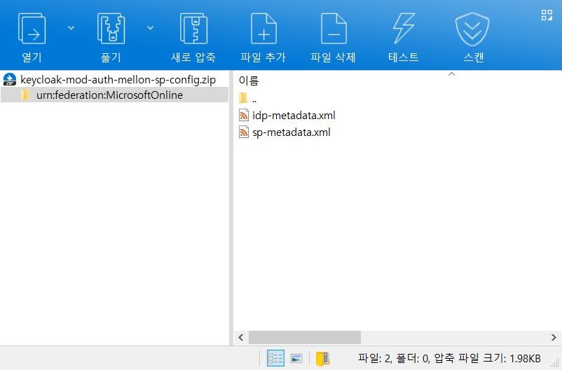
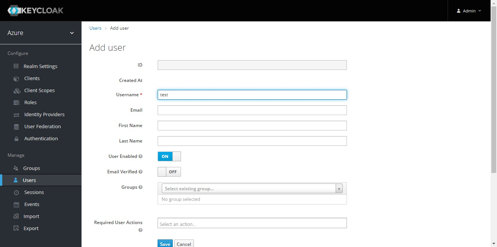
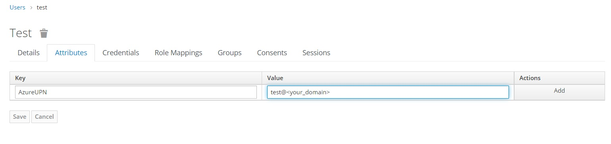
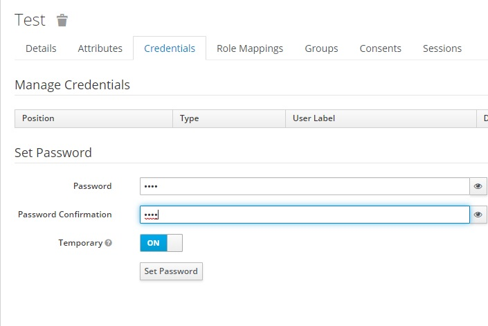

# Keycloak 설정  
## Realm 생성  
Realm위 화살표 - Add realm  
Add realm 위치  
  
생성 창  
  
- Name: `azure`  
*주의: Realm 이름에 대문자가 포함 될 경우 초대 수락이 안 되는 버그가 있음

## Client 생성  
Configure - Clients - Create  
Client 생성  
  
- Client ID: `urn:federation:MicrosoftOnline`  
- Client Protocol: `saml`  
- Client SAML Endpoint: `https://login.microsoftonline.com/login.srf`  
*Import를 사용할 경우 [이 파일](./urn_federation_MicrosoftOnline.json) 사용 및 [Test User생성](#Test-User-생성)으로 건너뛰기

Settings 탭 변경  
  
- Client Signature Required: `OFF`  
- Name ID Format: `persistent`  
*변경 후 탭 바꾸기 전에 save할 것  

Mappers 탭 Mapper 추가  
  
- Name: `AzureUPN`
- Mapper Type: `User Attribute`  
- User Attribute: `AzureUPN`  
- SAML Attribute Name: `http://schemas.xmlsoap.org/ws/2005/05/identity/claims/emailaddress`  
*변경 후 탭 바꾸기 전에 save할 것  

Installation 탭   
  
- Format Option: `Mod Auth Mellon files`  
DownLoad  

내려받은 파일 확인  
  

## Test User 생성
Manage - User  
신규 User 생성  
  
- Name: `test`  

Attributes 설정  
  
- Key: `AzureUPN`  
- Value: `test@\<your_domain\>`  
*Add 후 Save필요

Credentials 설정  
  
- Password 설정

*참고 문서  
https://docs.microsoft.com/ko-kr/azure/active-directory/external-identities/direct-federation